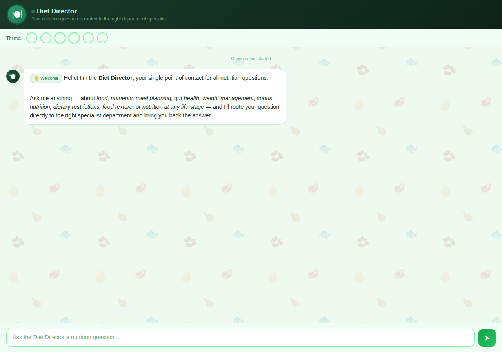

# nutrition-bot-ui

## How to Ask a Question

You have two ways to submit a nutrition question:

### Option 1 — GitHub Issue (easiest)
1. Click **Issues** at the top of this repository
2. Click **New Issue**
3. Choose the **"Nutrition Question"** template
4. Fill in your question and any optional context
5. Click **Submit new issue**

The Diet Director will read your question, route it to the right department, and the answer will be posted in the issue thread.

### Option 2 — questions/inbox.json (for direct bot use)
Open [`questions/inbox.json`](questions/inbox.json) and add an entry to the `questions` array with `"status": "pending"`. The Director will pick it up, route it, and update the entry with the answer.

---

## Theme URLs (6 Looks)

Base app URL: `https://starrm1.github.io/nutrition-bot-ui/`

| Theme | URL | Preview |
|---|---|---|
| 1 — Fruits 🍊🍋🍇🍌🍒 | [`?theme=theme-1`](https://starrm1.github.io/nutrition-bot-ui/?theme=theme-1) |  |
| 2 — Vegetables 🥦🥕🥬🌽🥒 | [`?theme=theme-2`](https://starrm1.github.io/nutrition-bot-ui/?theme=theme-2) |  |
| 3 — Mixed Foods 🥦🍎🥕🍓🥑 (default) | [`?theme=theme-3`](https://starrm1.github.io/nutrition-bot-ui/?theme=theme-3) |  |
| 4 — Proteins 🥚🥩🍗🐟🫘 | [`?theme=theme-4`](https://starrm1.github.io/nutrition-bot-ui/?theme=theme-4) |  |
| 5 — Grains 🌾🍞🥐🫓🥗 | [`?theme=theme-5`](https://starrm1.github.io/nutrition-bot-ui/?theme=theme-5) |  |
| 6 — Meals 🍲🫕🥘🍱🍜 | [`?theme=theme-6`](https://starrm1.github.io/nutrition-bot-ui/?theme=theme-6) |  |

---

## How Questions Are Routed — Director Routing

All questions go through the **Diet Director (bot_21)** first. The Director reads your question, identifies the topic, and automatically forwards it to the right department head. The department head works with their co and sub bots to answer it, then the answer comes back to you through the Director.

### Routing Flow

```
You → Diet Director (bot_21)
           ↓  (analyses your question topic)
     Correct Department Head
           ↓  (coordinates with co & sub bots)
     Answer → Diet Director → You
```

### Which Department Handles What?

| Department Head | Bot | Topics |
|---|---|---|
| Food Specialist | bot_22 | Food types, food groups, ingredients, food quality, storage, preparation |
| Nutrient Specialist | bot_23 | Vitamins, minerals, protein, carbs, fats, deficiencies, absorption |
| Meal Planning Specialist | bot_24 | Meal prep, weekly plans, portion planning, grocery lists, batch cooking |
| Texture Specialist | bot_25 | Soft/purée/modified texture diets, chewing/swallowing difficulty |
| Dietary Restriction Specialist | bot_26 | Allergies, intolerances, vegan, gluten-free, kosher, halal, elimination diets |
| Sports Nutrition Specialist | bot_27 | Athletic performance, pre/post workout, muscle building, recovery |
| Weight Management Specialist | bot_28 | Weight loss/gain, calorie deficit/surplus, metabolism, BMI |
| Gut Health Specialist | bot_29 | Probiotics, microbiome, IBS, bloating, fermented foods, digestive health |
| Life Stage Specialist | bot_30 | Pregnancy, infant, child, teen, adult, senior, menopause nutrition |

> If a question doesn't match any single department, the Director answers directly using full library access (all 20 library bots, access number 789). If a question spans multiple departments, the Director forwards it to all relevant departments and compiles a combined answer.

---
